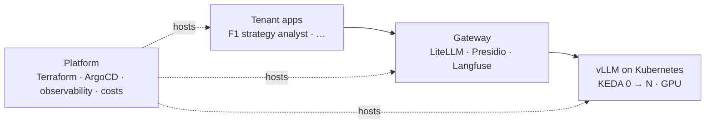

# Hi, I'm Maxence Labbé

**SRE / DevOps engineer in Bordeaux, France. I make sure services stay online, and I build the platforms that let companies use LLMs safely.**

- Running the infrastructure and deployments of a banking and real-estate platform in production (Docker, Ansible, GitLab CI, Grafana, Prometheus, Infisical).
- Former co-founder and CTO of a sovereign B2B AI suite for legal and finance professionals: RAG, semantic search, EU hosting, GDPR.
- Trained in tech (Epitech, MSc Information Systems Architect, Data & AI option) and in business (DUT GEA).

## Building in public: an internal AI platform

A fictional 200-person company gives its product teams access to LLMs through an internal platform run as a product. Each application is a **tenant** with its own API key, budget, namespace and dashboards.

| Repo | What it shows | Write-up |
| -- | -- | -- |
| [llmops-gateway](https://github.com/Mak5ens/llmops-gateway) | One entry point to every LLM: per-team keys and budgets, French PII anonymized with Presidio before inference, self-hosted Langfuse tracing | *Anonymiser avant d'inférer* (coming) |
| [llmops-platform](https://github.com/Mak5ens/llmops-platform) | Kubernetes from Terraform to GitOps with ArgoCD, vLLM scaled to zero by KEDA, GPU observability and cost per team, on Scaleway | *Une plateforme Kubernetes de A à Z en GitOps* · *Scaler des LLM à zéro* (coming) |
| [f1-strategy-analyst](https://github.com/Mak5ens/f1-strategy-analyst) | LangGraph agent writing sourced F1 strategy debriefs, human validation before publishing, an evaluation CI that blocks regressions | *Tester une IA comme on teste du code* · *Un agent IA qui sait s'arrêter pour demander* (coming) |

Next tenants: a D&D game master assistant (multi-tenancy) and a French residential lease compliance checker (GDPR end to end).

Rules of the game: standard market tools, one tool per job, every structuring choice justified in an ADR, and real numbers everywhere: latency, cost, scale-up time, quality scores.

## Everyday stack

**Infra & cloud** Docker, Kubernetes, Linux, Traefik, Nginx, Scaleway, OVH ·
**Automation** GitLab CI/CD, Ansible, Terraform ·
**Observability** Grafana, Prometheus, Loki, OpenTelemetry ·
**AI** LLM gateway, RAG, NER, self-hosted models (vLLM, Ollama) ·
**Data** PostgreSQL, MongoDB, Redis, S3 ·
**Code** Python, TypeScript, Bash, FastAPI, NestJS, React

## Contact

[maxence-labbe.fr](https://maxence-labbe.fr) · [LinkedIn](https://www.linkedin.com/in/maxence-labbe/) · [LabbTech](https://labbtech.fr), my consulting studio · Open to opportunities and missions, remote OK.
